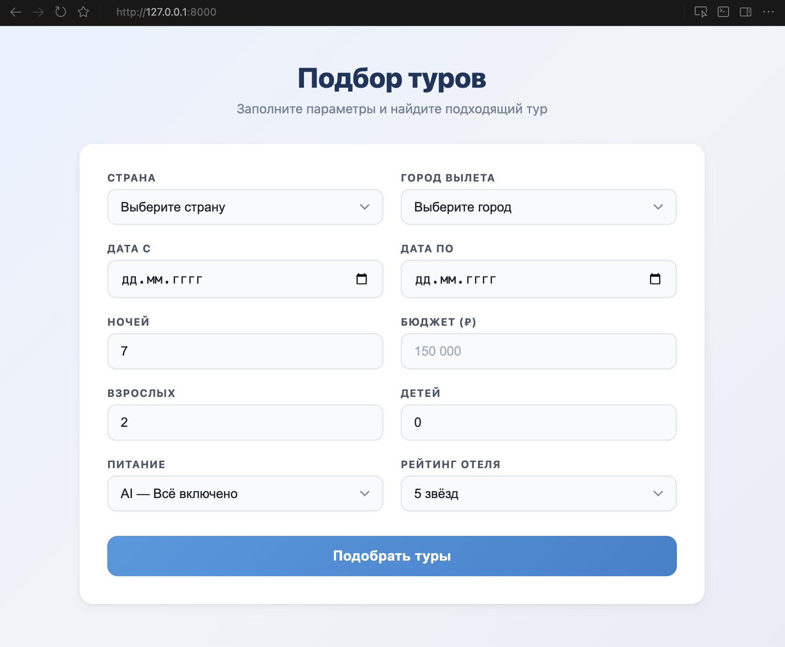
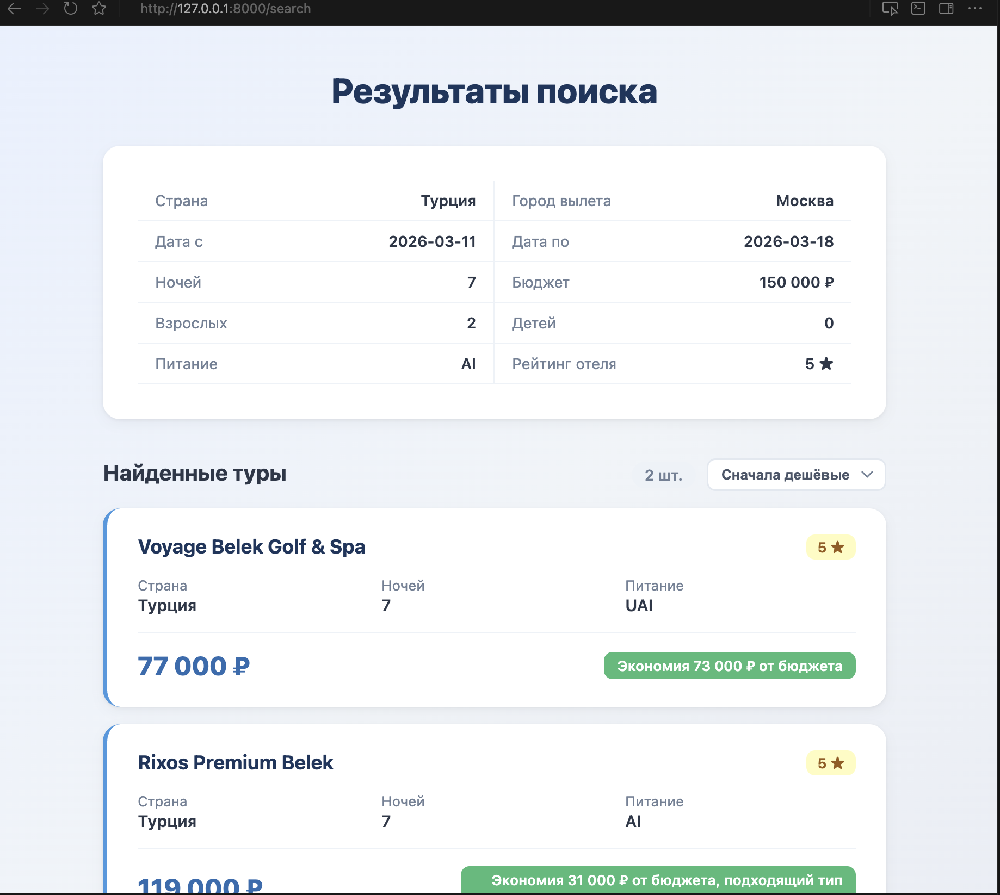
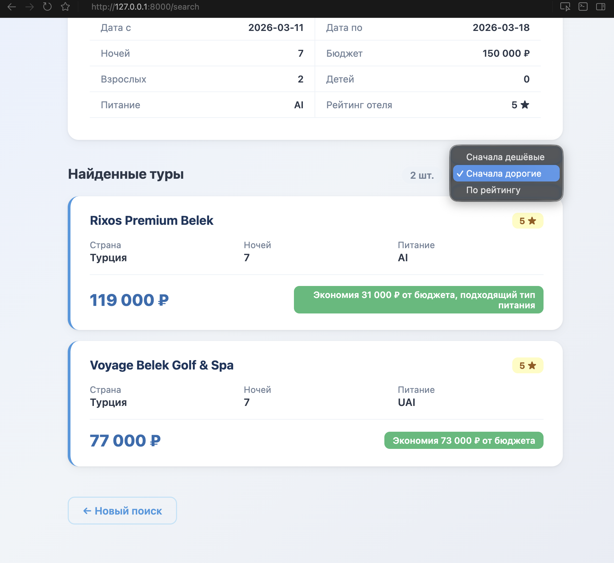
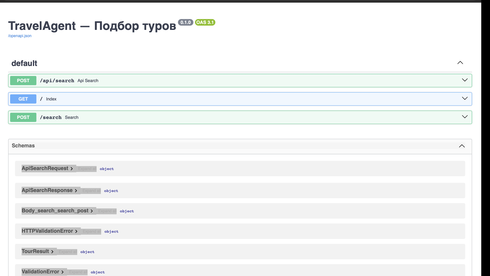

# TravelAgent — Сервис подбора туров

Веб-приложение для подбора туров, построенное на FastAPI + Jinja2 + Pydantic. Реализованы форма поиска с фильтрацией по 10 параметрам, страница результатов с карточками отелей и REST API. Проект демонстрирует навыки backend-разработки на Python: работу с веб-фреймворком, шаблонизацию, валидацию данных и проектирование API.

Менеджер заполняет параметры поиска (страна, даты, бюджет, количество гостей и т.д.),
система подбирает подходящие туры из базы и показывает результаты с рекомендациями.

---

## Скриншоты


### Форма поиска


### Результаты поиска


### Сортировка туров


### API документация


---

## Функциональность

- **Форма поиска туров** — 10 параметров: страна, город вылета, даты, ночи, бюджет, взрослые, дети, питание, рейтинг отеля
- **Подбор туров** — фильтрация по стране, рейтингу, бюджету, вместимости и типу питания
- **Карточки результатов** — название отеля, цена, характеристики и причина рекомендации
- **Сортировка** — по цене (дешёвые / дорогие) и по рейтингу отеля
- **REST API** — endpoint `POST /api/search` для интеграции с внешними системами
- **Автодокументация** — Swagger UI на `/docs`

---

## Технологии

| Технология | Назначение |
|---|---|
| Python 3.9+ | Язык программирования |
| FastAPI | Веб-фреймворк |
| Jinja2 | Шаблонизатор HTML |
| Pydantic | Валидация данных |
| Uvicorn | ASGI-сервер |
| HTML + CSS | Интерфейс (без фреймворков) |

---

## Структура проекта

```
TravelAgent/
├── app/
│   ├── __init__.py
│   ├── main.py              # Точка входа FastAPI
│   ├── api/
│   │   ├── __init__.py
│   │   └── routes.py         # Маршруты: веб-страницы и API
│   ├── models/
│   │   ├── __init__.py
│   │   └── schemas.py        # Pydantic-модели
│   ├── static/
│   │   └── styles.css         # Стили интерфейса
│   └── templates/
│       ├── index.html         # Форма поиска
│       └── results.html       # Страница результатов
├── requirements.txt
├── .gitignore
└── README.md
```

---

## Запуск проекта

### 1. Клонировать репозиторий

```bash
git clone https://github.com/your-username/TravelAgent.git
cd TravelAgent
```

### 2. Создать виртуальное окружение

```bash
python3 -m venv venv
source venv/bin/activate
```

### 3. Установить зависимости

```bash
pip install -r requirements.txt
```

### 4. Запустить сервер

```bash
uvicorn app.main:app --reload
```

### 5. Открыть в браузере

- Веб-интерфейс: [http://127.0.0.1:8000](http://127.0.0.1:8000)
- Swagger-документация: [http://127.0.0.1:8000/docs](http://127.0.0.1:8000/docs)

---

## API

### `POST /api/search`

Поиск туров по параметрам. Принимает JSON, возвращает JSON.

**Запрос:**

```bash
curl -X POST http://127.0.0.1:8000/api/search \
  -H "Content-Type: application/json" \
  -d '{
    "country": "Турция",
    "departure_city": "Москва",
    "date_from": "2026-06-10",
    "date_to": "2026-06-17",
    "nights": 7,
    "budget": 150000,
    "adults": 2,
    "children": 0,
    "meal_type": "AI",
    "hotel_rating": "4",
    "sort_by": "price_asc"
  }'
```

**Ответ:**

```json
{
  "tours": [
    {
      "hotel_name": "Justiniano Deluxe Resort",
      "country": "Турция",
      "nights": 7,
      "price": 53200,
      "meal_type": "AI",
      "hotel_rating": "4",
      "short_reason": "Экономия 96 800 ₽ от бюджета, подходящий тип питания"
    },
    {
      "hotel_name": "Voyage Belek Golf & Spa",
      "country": "Турция",
      "nights": 7,
      "price": 77000,
      "meal_type": "UAI",
      "hotel_rating": "5",
      "short_reason": "Экономия 73 000 ₽ от бюджета, рейтинг выше запрошенного"
    },
    {
      "hotel_name": "Rixos Premium Belek",
      "country": "Турция",
      "nights": 7,
      "price": 119000,
      "meal_type": "AI",
      "hotel_rating": "5",
      "short_reason": "Экономия 31 000 ₽ от бюджета, рейтинг выше запрошенного, подходящий тип питания"
    }
  ]
}
```

**Параметры сортировки (`sort_by`):**

| Значение | Описание |
|---|---|
| `price_asc` | Сначала дешёвые (по умолчанию) |
| `price_desc` | Сначала дорогие |
| `rating_desc` | По рейтингу отеля |

---

## Архитектура

Проект построен по простой трёхслойной схеме:

```
Браузер / API-клиент
        ↓
   routes.py          ← маршруты (веб + API)
        ↓
   search_tours()     ← бизнес-логика (фильтрация + сортировка)
        ↓
   MOCK_TOURS         ← источник данных (mock)
        ↓
   schemas.py         ← Pydantic-модели (валидация вход/выход)
```

- **Веб-интерфейс** (`GET /`, `POST /search`) — HTML-формы через Jinja2
- **REST API** (`POST /api/search`) — JSON вход/выход
- Оба интерфейса используют одну и ту же логику подбора и сортировки

---

## Возможные улучшения

- **Интеграция с реальным API поиска туров** — подключение Sletat.ru или аналогичного сервиса вместо mock-данных
- **База данных** — PostgreSQL или SQLite для хранения истории поиска, избранных туров и данных клиентов
- **Авторизация пользователей** — регистрация и вход для менеджеров, разграничение доступа
- **Улучшение интерфейса** — добавление фильтров, пагинации, сравнения туров, адаптивного дизайна
- **Кэширование запросов** — Redis для ускорения повторных поисков
- **Тесты** — unit- и интеграционные тесты с pytest
- **Docker** — контейнеризация для простого развёртывания
